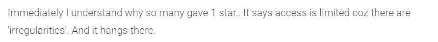
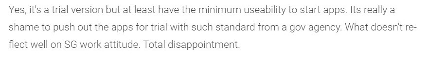

MAD_Team05_P03_ASG

<h1>Into the Unknown</h1>
<h2>Discover SG's parks</h2>
  
 
  
<h3>Table of contents</h3>
<ul>
  <li><a href = "#intro">Introduction of Application</a></li>
  <li><a href = "#target">Target Audience</a></li>
  <li><a href = "#race">Competitors</a></li>
  <li><a href = "#features">Comparsion of features</a></li>
  <li><a href = "#demo">Demonstration of Application</a></li>
  <li><a href = "#conclude">Conclusion</a></li>
  <li><a href = "#contribute">Our Individual Contributions</a></li>
</ul>

<h3 id = "intro">Introduction of Application</h3>
<h4>Creators of the application</h4>

Into the Unknown is an application developed by a team of 3 students from Ngee Ann Polytechnic. The team consists of Pulavarthi Shravya, Tan Le Xuan Tricia and Teo Wei Jie.

<h4>About Into the Unknown & Purpose</h4>

This application aims to connect both foreigners and locals to view the 300+ local parks in Singapore.Users can look through by using our application that lists all the parks in Singapore.

<h4>Application Icon</h4>

Into the Unknown's app icon! The application icon is mainly made of much greenery to represent the nature, which is what the application is all about.

 

<h3 id = "target">Target Audience</h3>
<h4>Who are our main users of the application?</h4>

There are many who love going to the park to involve themselves in various activities from babies till senior citizens. So who are our target audience? As mentioned earlier, our main purpose of the application is for people to look at the various parks that are around Singapore.

Hence, our target audience would mainly be:

Nature lovers/Adventures

 

However, our application is not only limited to them. Others can also use our application as we do have features that cater to them by showing the common facilities/activities at the various parks. Hence, along with nature lovers/adventure seekers our application also caters to the following groups too!

Families

People who exercise at parks

 

<h3 id = "race">Our Main Competitor</h3>

From our search in Google Play Store, our only competitor is NParks Coast to Coast. This application shows users the coastal trail for hikers to hike from their location to Coney Island only.

<h4>Drawbacks of our Competitiors</h4>

The application displays parks available. However it does not display all the 300+ parks available in Singapore. Moreover, this app (in our opinion) only caters to 1 group of people -> Adventure Seekers. Families and those who love to exercise at the park would not find this application useful and would not really cater to their needs.

Furthermore, it has not been given a very positive review due to often "hanging" of application and "irregularities". Adding on, users have said that is does not have "minimum useability to start apps". This shows that many are very unhappy with the application.

Looking at these reviews, we have decided to create the application to tackle them and give interested users a better experience to discover Singapore.

 

<h3 id = "features">Comparing features with our Competitiors</h3>

We mentioned some of the drawbacks of our competitior based on the reviews given by the public. In this section, we will be looking at the features that our application will provide unlike our competitior.

<table>
  <tr>
    <th>Features</th>
    <th>NParks</th>
    <th>Into the Unknown</th>
  </tr>
  <tr>
    <th>Displaying of 300+ parks</th>
    <th>
&#10060;
</th>
    <th>
&#10004
</th>
  </tr>
  <tr>
    <th>Search Parks of Interest</th>
    <th>
&#10060;
</th>
    <th>
&#10004
</th>
  </tr>
  <tr>
    <th>Calculating Transport Fare</th>
    <th>
&#10060;
</th>
    <th>
&#10004
</th>
  </tr>
  <tr>
    <th>Display Weather</th>
    <th>
&#10060;
</th>
    <th>
&#10004
</th>
  </tr>
  <tr>
    <th>Show available activities</th>
    <th>
&#10060;
</th>
    <th>
&#10004
</th>
  </tr>
  
  
Based on this table, we have shown you what are the various features that our application will consist of. We believe that this would give users the things they are looking out for in such an application

</table>

 

<h3 id = "demo">Demonstration of our application</h3>

After looking the table, you might be wondering, the functionality of our application. Look at the video below to get an insight of Into the Unknown into action!

 

<h3 id = "conclude">Conclusion</h3>

Based on the demo, we hope that you have a clearer insight of how our application functions! We hope that you will have a pleasent experience using this application!

<h3 id = "contribute">Our Individual Contributions</h3>

Shravya

<ul>
  <li>Searched for needed API for relevant pages</li>
  <li>Coded using JSON for API in relevant pages</li>
  <li>API + Layout + Intent for weather page</li>
  <li>Display all parks using api</li>
  <li>Filter for parks when searching by name</li>
  <li>JSON coding for view parks by region</li>
  <li>Intent to LTA website to calculate transport fares</li>
 </ul>
 
 
Tricia

<ul>
  <li>Layout for all pages</li>
  <li>Intent for all pages</li>
  <li>Recycler View coding (displaying the parks based on Region and Search by name)</li>
  <li>Transport Intent to LTA website to calculate transport fares</li>
  <li>Filter for parks when searching by name</li>
 </ul>
 
  
Wei Jie

<ul>
  <li>Countdown Timer from splash screen -> search page</li>
  <li>Pitch PPT slides</li>
</ul>
  
  
    

 
