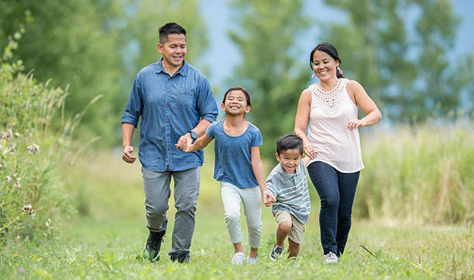

MAD_Team05_P03_ASG

<h1>Into the Unknown</h1>
<h2>Discover SG's parks</h2>
  
 
  
<h3>Table of contents</h3>
<ul>
  <li><a href = "#intro">Introduction of Application</a></li>
  <li><a href = "#target">Target Audience</a></li>
  <li><a href = "#race">Competitors</a></li>
  <li>Comparsion of features</li>
  <li>Additional Features</li>
  <li>Demonstration of Application</li>
  <li>Conclusion</li>
</ul>

<h3 id = "intro">Introduction of Application</h3>
<h4>Creators of the application</h4>

Into the Unknown is an application developed by a team of 3 students from Ngee Ann Polytechnic. The team consists of Pulavarthi Shravya, Tan Le Xuan Tricia and Teo Wei Jie.

<h4>About Into the Unknown & Purpose</h4>

This application aims to connect both foreigners and locals to view and explore the 300+ local parks in Singapore.Users can also discover the hidden gems of the parks and re-discover areas that they have never been to.The application will be available to the public in Google Play Store only.

<h4>Application Icon</h4>

Into the Unknown's app icon! The application icon is mainly made of much greenery to represent the nature, which is what the application is all about.

 

<h3 id = "target">Target Audience</h3>
<h4>Who are our main users of the application?</h4>

There are many who love going to the park to involve themselves in various activities from babies till senior citizens. So who are our target audience? As mentioned earlier, our main purpose of the application is for people to explore the various parts of Singpore that they have never been to.

Hence, our target audience would mainly be:

Nature lovers/Adventures

 

However, our application is not only limited to them. Others can also use our application as we do have features that cater to them by showing the available facilities/activities at the various parks. Hence, along with nature lovers/adventure seekers our application also caters to the following groups too!

Families

People who exercise at parks

 

<h3 id = "race">Our Main Competitor</h3>

 
